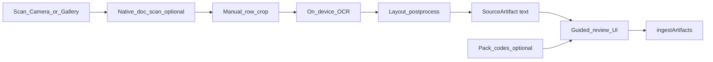

# OCR camera Source — evaluation & spike

Stand: 2026-07-25 · Privacy: **on-device only** (no Fr4iser/cloud upload of roster photos).

## Verdict

Photograph → on-device OCR → text → **guided review** → ingest fits `Source → Pack → ingest`.  
Do **not** promise fully automatic parse of arbitrary wall plans. OCR is easy; table layout + employer codes are hard.

## v1 product decision (locked)

**Guided review UI**, not auto `parserId` as the primary path.

| Approach | Role in v1 |
|----------|------------|
| **Guided review** (chosen) | OCR → editable suggestions (date / code / times) → user confirms → `ShiftEntry` / ingest |
| Roster-list `parserId` | Optional later helper once line format is stable; never silent merge without review in v1 |

Rationale: Accuracy on photos varies; product already requires users to verify schedules. Review matches disclaimers and avoids wrong calendar events.

Spike today: **document scan (deskew) → manual row crop → OCR → raw text** — **no** `ingestArtifacts` / store merge.

## Capture UX (end-user friendly)

| Step | What | Native |
|------|------|--------|
| **Plan scannen** | Edge detect + perspective warp | `react-native-document-scanner-plugin` |
| **OCR + boxes** | Lines with geometry | `expo-mlkit-ocr` |
| **Wer bist du?** | Detect left-column `Nachname, Vorname` → pick / auto-match | [`names.ts`](../../src/sources/ocr/names.ts) + [`OcrNamePickerModal`](../../src/ui/OcrNamePickerModal.tsx) |
| **Remember me** | Last pick in `ocr.preferredRosterName` — strong match skips the picker | [`ocrPreferredName.ts`](../../src/state/ocrPreferredName.ts) |
| **Manual crop** | Fallback only (button) when names fail | [`OcrCropModal`](../../src/ui/OcrCropModal.tsx) |

Rules:

- One explicit capture mode per tap — **no** silent “scan failed → try camera”.
- Name pick cancel aborts the run.
- Auto-select only for a **strong** preferred match (≥ 0.85); otherwise show the list.
- Auto “guess without ever asking” on first use is **not** done — first pick teaches the preference.

## Layout profiles (structure ≠ OCR engine)

OCR engine is generic. **Structure understanding is layout-specific** (month matrix vs day plan vs list …).

Rules (same spirit as no-retry / one-path):

- User picks **one** concrete layout, or **`auto`** (detect once, then run that winner).
- **`auto` is detection meta, not a layout.**
- **Pro order:** detect layout from the **image lattice** (H/V lines) first; OCR-text cues only if the image score is weak. Never “try month → fail → try list”.
- Weak/unclear structure under `auto` → **text-only fallback** (`text-only`) — clear outcome, **not** a layout chip, not a second parser attempt.
- New AG forms = **new layout id + own file** when real photo samples arrive; do not bolt heuristics onto text-only.
- Stub layouts today only trim whitespace; real cell/line parsers land in `postprocess` (or a sibling module) per id.

Registry: [`src/sources/ocr/layouts/`](../../src/sources/ocr/layouts/) (one file per layout + `index.ts`)  
Detection: [`src/sources/ocr/detectLayout.ts`](../../src/sources/ocr/detectLayout.ts)  
Preference: `ocr.activeLayoutId` via [`src/state/ocrLayout.ts`](../../src/state/ocrLayout.ts)

| Id | Status | Intent |
|----|--------|--------|
| `auto` | experimental | Detect layout once → run that concrete path (meta, not a layout) |
| `month-matrix` | experimental | Wall plan: name × day grid → ASCII table; names **only** from grid rows |
| `week-strip` | stub | Mo–Su / ward board |
| `list-protocol` | stub | Lines like date · code · von–bis |
| `day-plan` | stub | Tagesplan: one day, many people/slots |
| `single-calendar` | stub | Einzelkalender: one name, month calendar cells |
| `text-only` | fallback | Debug/raw text only — **not** listed as a layout |

**month-matrix rule:** if the grid cannot be built, show “table not recognized” — **never** open the name picker with plain-text OCR junk.

**Cell-frame / lattice correction plan:** [`ocr-lattice-frames-plan.md`](./ocr-lattice-frames-plan.md) (professional H×V frames, scaling, privacy).

### Geometry fixtures

- **Never commit workplace dumps/photos** (Dienstplan-PII).
- Local-only path: `$SHIFTPLAN_OCR_PRIVATE`
  - `dumps/<SHIFTPLAN_OCR_PRIVATE_DUMP_CROP>.json`, `dumps/<SHIFTPLAN_OCR_PRIVATE_DUMP_HIRES>.json`
  - `expected.json`, `sample.json`, `photos/*`
- In-repo safe: [`tests/fixtures/ocr/month-matrix/pack-expected.json`](../../tests/fixtures/ocr/month-matrix/pack-expected.json) (time→code only).
- Device dump: set `EXPO_PUBLIC_OCR_DUMP_GEOMETRY=1`, run OCR once, copy geometry JSON into the private dir (do not push to git).

### How to add or tune a layout (when samples arrive)

1. Collect 2–5 representative photos (same AG form, decent lighting).
2. Run Fetch → Foto → that layout (or let `auto` fall back to text-only) and keep OCR geometry under `/tmp/shiftplan-ocr-private/` (**never** commit real names/photos).
3. Add `src/sources/ocr/layouts/<id>.ts` (profile + `score*`) and register it in `layouts/index.ts`.
4. Implement `postprocess` (and later guided-review suggestions) against the fixtures — **one path**, fail clearly on unexpected structure.
5. Add a unit test that feeds fixture text → expected cleaned / suggested rows.
6. Bump i18n `ocrLayout*` label/hint; set `status: 'ready'` only when review→ingest is trustworthy enough for that form.

## Architecture fit

| Piece | Choice |
|-------|--------|
| Source id | `camera-ocr` in [`src/sources/cameraOcr.ts`](../../src/sources/cameraOcr.ts) |
| Kind | `local` — no credentials, no WebView |
| Artifact | `{ kind: 'text', text }` after OCR + layout postprocess |
| OCR engine | On-device ML Kit / Vision via `expo-mlkit-ocr` (Dev Client / native rebuild required) |
| Capture | Document scan (deskew) + camera/gallery; then manual row crop |
| Layout | User-selected profile; stubs until samples |
| Crop UI | [`OcrCropModal`](../../src/ui/OcrCropModal.tsx) |

Contract stays thin: `Source.run` → artifacts. OCR + layout cleanup are inside the Source (same idea as DocumentPicker in `local-files`).

## Common roster forms (DE)

1. **Month matrix** — rows = people (or one), cols = days, cells = codes (`F`/`S`/`N`, `U`/`K`, AG-specific). Often coloured + legend.
2. **Week strip / ward board** — Mo–Su × shifts × names; dense; handwritten overlays common.
3. **List / protocol** — `date | code | start–end` (closest to LOGA3 Zeitprotokoll; easiest OCR).
4. **Printed Excel/PDF photo** — clean glyphs, perspective/shadow issues.
5. **Monitor screenshot** — good if square-on; moiré/glare otherwise.
6. **Handwriting / Post-its** — **out of scope for v1**.

## Coverage priority

**v1**

- One person (“my row”), printed Latin text, decent contrast, plan roughly parallel to camera
- Camera + gallery → OCR → layout pick → review (spike: raw text only)
- Output target: `date + type (+ start/end)` after user confirm

**v1.5**

- Single-row month matrix (day columns → codes); Pack mapping as code lexicon for corrections

**Later / do not promise**

- Multi-person matrix auto name-match, colour-only cells, handwriting
- Fully automatic row detection without user crop

## OCR stack

| Engine | Use |
|--------|-----|
| **ML Kit / Apple Vision** (`expo-mlkit-ocr`) | v1 / spike — on-device |
| Tesseract | Not preferred (weaker on phone photos) |
| Cloud Vision | **Forbidden in v1** (Data Safety / architecture) |

Native module is **not** in Expo Go — rebuild Dev Client after adding the plugin (`app.config.js` / `app.json` plugins).

OCR returns flat text or lines+boxes; **table understanding is app logic** (layout profiles), not the OCR API.

## Spike status

| Item | Status |
|------|--------|
| Doc (this file) | done |
| Source `camera-ocr` + registry | done |
| Fetch UI chip + raw text panel | done |
| Layout chips + persistence | done (stubs until samples) |
| Document scan + row crop | done (needs native rebuild) |
| On-device OCR behind adapter | done (needs native rebuild for real text) |
| Auto-ingest | **not** in spike |
| Guided entry editor | planned post-spike |

## Out of scope (same as plan)

- Cloud OCR  
- “Any hospital wall plan, fully automatic”  
- Silent multi-layout try  
- Mixing with second WebView Source (Phase 6)
