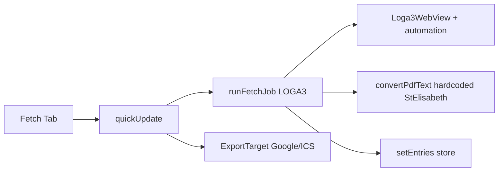
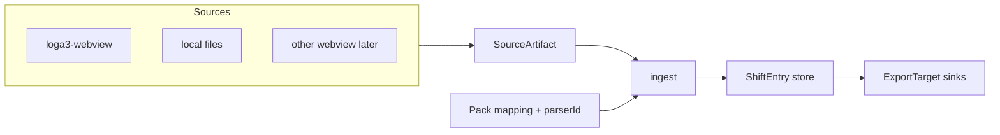

# Refactor-Plan: generischer Converter (Source → Pack → Sink)

Stand: 2026-07-25 · Zielbild: [`roadmap.md`](roadmap.md)

## Ist-Zustand



| Schicht | Heute | Lücke |
|---------|--------|--------|
| **Sinks** | `ExportTarget` in `src/sync/targets/` | — schon ok |
| **Packs** | Katalog + Mapping in `src/packs/` | kein `parserId` / `sourceId` |
| **Convert** | `ShiftEntry`, `parseTimeSheet(parserFn)` | `convertPdfText` hardcodet `parseStElisabeth` |
| **Fetch** | `runFetchJob` | mischt Source + Convert + Store |
| **Setup** | LOGA3-URL+Creds Pflicht | blockiert „nur Datei“ |

---

## Soll-Zustand



**Vertrag:** Source liefert Rohmaterial. Pack + Convert machen Schichten. Preview/Export bleiben source-agnostisch. LOGA3 ist *eine* Source, nicht der Produktkern.

---

## Was zentralisieren

| Schicht | Zentral | Pro Plugin |
|---------|---------|------------|
| **Ingest** | `ingestArtifacts(artifacts, packScope) → merge store` | — |
| **Convert** | `convertRaw` + Parser-Registry | `parseXxx` |
| **Pack** | Catalog, Mapping, Presets, `parserId`, `preferredSourceId` | Pack-JSON + Parser |
| **Source** | Interface + Registry + Status-Callbacks | Site-Automation / File-Picker |
| **WebView-Host** | Bridge, wait, PDF-capture hooks, inject shell, viewport-Optionen | Commands, Layout-CSS, URL/Creds |
| **Sink** | schon `ExportTarget` | Google / ICS |

**Nicht zentralisieren:** LOGA3-Selektoren, Layout-Fix-CSS, Abrechnungsmonat-Gates, Desktop-1280 als globale Konstante (pro Source konfigurierbar).

---

## Einheitlicher Ablauf

1. Source wählen (Pack-`preferredSourceId` oder User)
2. `source.run({ period, credentials?, host? })` → `SourceArtifact[]`
3. `ingestArtifacts` → Parser aus Pack → `ShiftEntry[]` → Store-Merge
4. Sinks: bestehendes `runEnabledOauthTargets` / ICS

### Source-Interface

```ts
type SourceArtifact =
  | { kind: 'pdf'; month?: number; year?: number; bytes: Uint8Array }
  | { kind: 'text'; month?: number; year?: number; text: string }
  | { kind: 'csv' | 'ics'; text: string }
  | { kind: 'skipped'; month: number; year: number; reason: string };

interface Source {
  id: string;
  kind: 'webview' | 'local';
  needsCredentials: boolean;
  needsWebView: boolean;
  run(opts: SourceRunOpts): Promise<{ artifacts: SourceArtifact[]; errors: string[] }>;
}
```

**One-path bleibt:** Framework = Waits + klare Errors. Keine Fallback-Klickpfade in Plugins (siehe Workspace-Rule).

### WebView-Framework (shared)

| Shared (`src/sources/webview/`) | LOGA3-Plugin |
|---------------------------------|--------------|
| `AutomationBridge`, `waitForCondition` | Command-Set / DOM / UINs |
| PDF arm/capture + Android-Poll + Nav-Block | `layoutFixInject`, contentGate |
| Host-Shell: inject, onMessage, cookies | Creds/URL-Keys |
| Viewport `{ desktopWidth, scale }` | Konkrete 1280 + UA |

LOGA3-Plugin: `src/sources/webview/loga3/` (kein Compat-Shim unter `src/loga3/`).

---

## Packs gestalten

Erweiterung der Builtin-Config (rückwärtskompatibel):

```json
{
  "id": "st-elisabeth-leipzig",
  "parserId": "st-elisabeth-zeitprotokoll-pdf",
  "preferredSourceId": "loga3-webview",
  "supportedSourceIds": ["loga3-webview", "local-pdf"],
  "groups": {}
}
```

- **`parserId`** → Registry `src/convert/parsers/`
- **`preferredSourceId`** → Fetch-Default; Local braucht keinen Login
- Mapping-JSONs bleiben (Farben/Presets)
- Später ZIP-Katalog: gleiches Schema; Parser bundled oder bekannte `parserId`s

`convertPdfText` / `convertRaw` resolve Mapping+Parser **nur** über Pack-Scope — keine Hardcode-Defaults als Produktionspfad.

---

## Phasen (mergebare PRs)

| Phase | Was | DoD |
|-------|-----|-----|
| **0 Doku** | Dieser Plan + Architektur-Skizze | verlinkt aus Roadmap |
| **1 Ingest peel** | `SourceArtifact` + `ingestArtifacts`; `runFetchJob` ohne convert/store | Live + Fixture + Matrix grün |
| **2 Parser-Registry** | Pack `parserId`; Registry; St. Elisabeth als Eintrag | Neuer AG = Pack + Parser, Fetch unberührt |
| **3 Source-Interface** | Registry; LOGA3-Adapter; Setup nur Creds wenn `needsCredentials` | UI spricht Source-API |
| **4 WebView shared** | Bridge/Wait/PDF/Host nach `sources/webview/` | Kein Duplikat Capture; Verhalten gleich |
| **5 Local import** | DocumentPicker PDF → CSV/ICS; Fetch tab „Datei“ | Ohne Login → Preview → Export |
| **6 2nd WebView** | Nur bei konkretem zweiten AG | — |

Reihenfolge strikt: `1 → 2 → 3 → 4 → 5 → (6)`. Kein Big-Bang.

---

## Development-Vorbereitung

- **Tests:** Ingest mit Fake-Artifacts; Source-Contract mit Mock-Host
- **E2E:** Matrix bleibt LOGA3; plus Smoke „local PDF fixture → entries“
- **Storage:** `loga3.*`-Keys vorerst lassen; neu nur `source.activeId` o.ä.
- **i18n:** „Abrufen / Importieren“ generisch; LOGA3 nur am Portal-Login
- **Rules:** One-path gilt für jedes Plugin unter `src/sources/**`
- **Store:** Phase 1–2 parallel Internal Test ok; Phase 5 = starker Mehrwert ohne Markenrisiko

## Out of scope

- Retries / zweite Klickpfade
- Outlook / CalDAV First-Class
- Pack-ZIP-Marketplace (Schema in Phase 2 vorbereiten)
- Sofort-Rename aller `loga3.*` AsyncStorage-Keys
